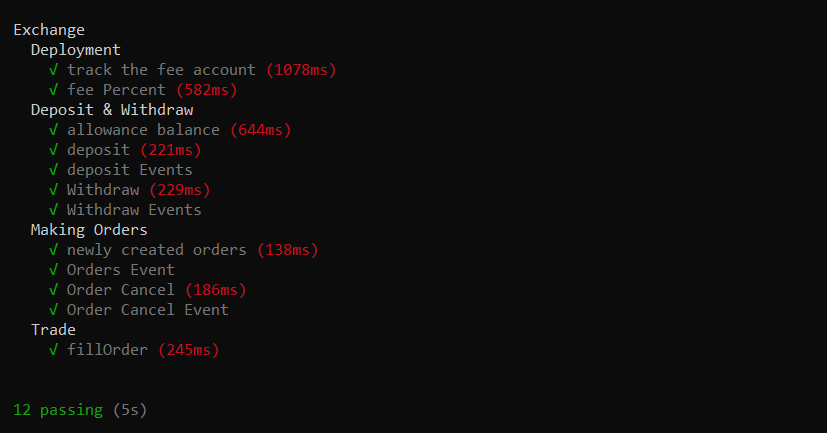

# dEx
Decentralized exchange Onchain - Orderbook Dapp
A decentralized exchange allow trading with ERC20 tokens using orderbook. Users can deposit / withdraw tokens between their Metamask wallets and their VARMA Exchange account.

## Tech
```
Solidity [ ERC20, Exchange ]
Next JS
Subgraph [The Graph]
Google Charts
Tailwindcss
```

## Installation/Running
```
cd dex-app
yarn install 
yarn dev
```


## Tests:
```
cd dex-contract
yarn install
yarn hardhat run test
```



## Development Environment
https://user-images.githubusercontent.com/28341697/197338606-fff71b70-c77f-42e7-ba51-42622dc76af1.mp4


## Working 
https://user-images.githubusercontent.com/28341697/197338625-c8800ede-277b-4ed5-8915-e9cf426d7dce.mp4


## Images

